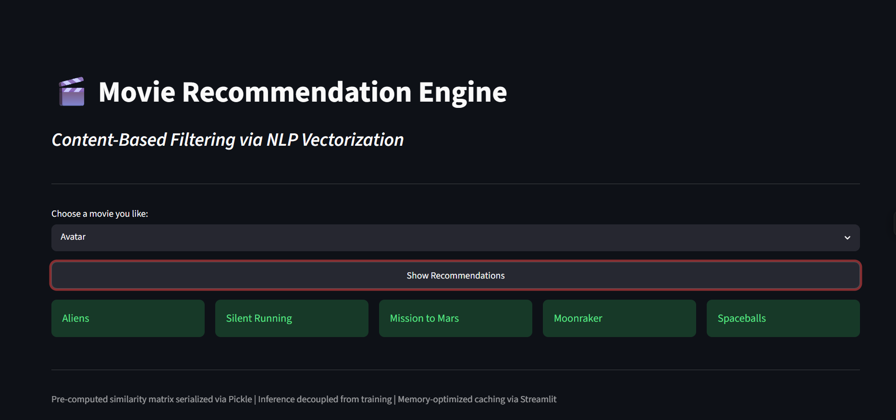

# 🎬 Movie Recommendation Engine

**Content-Based Filtering via NLP Vectorization**

A movie recommendation system built on the TMDB 5000 dataset. Select any movie and instantly get 5 similar recommendations powered by cosine similarity on NLP-derived feature vectors.

---

## 🚀 Live Demo

> Coming soon — deployment in progress



---

## 🧠 How It Works

### 1. Feature Engineering
Five content signals are extracted per movie and merged into a single `tags` vector:

| Signal | Source Column | Detail |
|---|---|---|
| Plot description | `overview` | Whitespace tokenized |
| Genres | `genres` | Parsed from JSON |
| Thematic tags | `keywords` | Parsed from JSON |
| Top 3 actors | `cast` | Names collapsed (no spaces) |
| Director | `crew` | Extracted by job title |

### 2. Text Preprocessing
- All tags lowercased and concatenated into a single string per movie
- Porter Stemmer applied — reduces word variants to a common root (`fighting` → `fight`) so thematically identical words match regardless of form

### 3. Vectorization
- `CountVectorizer` with `max_features=8000` and English stopwords removed
- Produces a **(4800 × 8000)** sparse matrix — each movie is a vector in 5000-dimensional word space

### 4. Similarity Computation
- Cosine similarity computed across all movie pairs → **(4800 × 4800)** similarity matrix
- Cosine similarity measures the **angle** between two vectors, not their magnitude — so a movie with a short overview isn't penalized vs one with a long one
- Matrix is precomputed at build time and serialized via Pickle for sub-second inference at runtime

### 5. Inference
```
User selects a movie
→ Fetch its row from similarity matrix
→ Sort all 4800 scores descending
→ Skip index 0 (the movie itself, score = 1.0)
→ Return top 5 titles
```

---

## 🛠️ Tech Stack

| Layer | Tool |
|---|---|
| Data processing | `pandas`, `numpy` |
| NLP | `nltk` (PorterStemmer) |
| Vectorization | `scikit-learn` (CountVectorizer) |
| Similarity | `scikit-learn` (cosine_similarity) |
| Serialization | `pickle` |
| UI | `streamlit` |

---

## 📁 Project Structure

```text
movie-recommender/
├── app.py                      # Streamlit UI
├── data/
│   ├── tmdb_5000_movies.csv
│   └── tmdb_5000_credits.csv
├── notebooks/
│   └── exploration.ipynb       # EDA and model artifact generation
├── requirements.txt
├── README.md
├── movies.pkl                  # Generated artifact used by the app
└── similarity.pkl              # Generated artifact used by the app
```

> The app expects `movies.pkl` and `similarity.pkl` to exist in the project root. These are generated when the notebook is run.

---

## ⚙️ Run Locally

```bash
# Clone the repo
git clone https://github.com/geeky-utkarsh-2307/movie-recommender
cd movie-recommender

# Install dependencies
pip install -r requirements.txt

# Generate the model artifacts
# Open notebooks/exploration.ipynb and run it to create movies.pkl and similarity.pkl

# Launch the app
streamlit run app.py
```

---

## 🔍 Design Decisions

**Why content-based and not collaborative filtering?**
Collaborative filtering requires user interaction history (ratings, watch time). The TMDB dataset has no user behaviour data — only movie metadata. Content-based is the correct approach here.

**Why CountVectorizer over TF-IDF?**
TF-IDF penalizes frequent terms globally. In this domain, high-frequency terms like `"action"` or `"love"` are genuinely meaningful genre signals — not noise. CountVectorizer preserves their weight.

**Why Porter Stemmer over Lemmatization?**
The stemmed tags are never displayed to the user — they only exist inside the similarity computation. Lemmatization's advantage (real word output) is irrelevant here. Porter Stemmer is faster and sufficient.

**Why precompute the similarity matrix?**
Computing cosine similarity at query time over 4800 vectors would introduce latency on every request. Precomputing and pickling the full matrix reduces inference to a single array lookup — effectively O(1).

---

## 🔮 Future Ideas

- Add movie posters and richer UI details
- Blend with collaborative filtering for a hybrid recommender
- Add genre, language, or year filters
- Compare CountVectorizer with TF-IDF
- Add evaluation metrics such as Precision@K

---

## 📊 Dataset

[TMDB 5000 Movie Dataset](https://www.kaggle.com/datasets/tmdb/tmdb-movie-metadata) — Kaggle  
~4800 movies after merging and null removal. Two source files: `tmdb_5000_movies.csv` and `tmdb_5000_credits.csv`.

---
